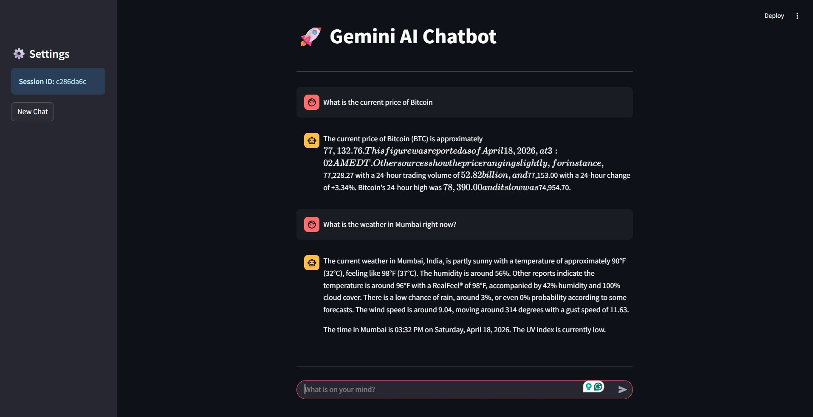

# 🚀 Gemini AI Chatbot — Memory + Real-Time Search

A conversational AI chatbot powered by **Google Gemini 2.0 Flash** with **persistent conversation memory** and **real-time web search** via the Google Custom Search API. Ask about live Bitcoin prices, today's weather, breaking news, and more.

---

## ✨ Features

| Feature | Description |
|---|---|
| 🧠 **Conversation Memory** | Retains full multi-turn chat history within and across sessions |
| 💾 **Persistent Storage** | History saved and reloaded automatically on restart |
| 🔍 **Real-Time Search** | Auto-detects queries needing live data and fetches from Google |
| ⚡ **Smart Triggering** | Keyword heuristic gates search calls — no wasted API quota |
| 🛡️ **Safety Filters** | Gemini safety settings block harmful content categories |

---

## 📸 Dashboard



*Real-time queries like Bitcoin price and Mumbai weather answered with live Google Search data.*

---

## 🔄 Workflow

```
User Input
    │
    ▼
needs_search(query)?
    │
    ├── YES → google_search() → Prepend snippets to prompt
    │
    └── NO  ──────────────────────────────────┐
                                              ▼
                              Gemini 2.0 Flash + full history
                                              │
                                              ▼
                                        Reply → saved to memory
```

---

## 🚀 Setup & Installation

### 1. Clone the repository

```bash
git clone https://github.com/Swara-art/Gemini-Chatbot
cd Gemini-Chatbot
```

### 2. Create a virtual environment

```bash
uv venv
source .venv/bin/activate        # macOS / Linux
.venv\Scripts\activate           # Windows
```

### 3. Install dependencies

```bash
pip install -r requirements.txt
```

### 4. Configure environment variables

```bash
cp .env.example .env
# Fill in your API keys (see below)
```

---

## 🔑 API Key Configuration

Add the following to your `.env` file.

### A. Gemini API Key

1. Go to [Google AI Studio](https://aistudio.google.com/app/apikey)
2. Click **Get API key → Create API key**
3. Paste it into `.env`:
   ```
   GEMINI_API_KEY=AIza...
   ```

### B. Google Custom Search API Key & Engine ID *(for real-time search)*

```
GOOGLE_SEARCH_API_KEY=AIza...
GOOGLE_SEARCH_ENGINE_ID=1234567890abc
```

> **Note:** The chatbot works without the search keys — it will answer from Gemini's training knowledge and skip live data fetching.

---

## 📄 License

This project is licensed under the **MIT License**.

---

<div align="center">

Built with ❤️ using [Google Gemini](https://deepmind.google/technologies/gemini/) · [Google Custom Search](https://developers.google.com/custom-search) · [Python](https://python.org)

</div>
